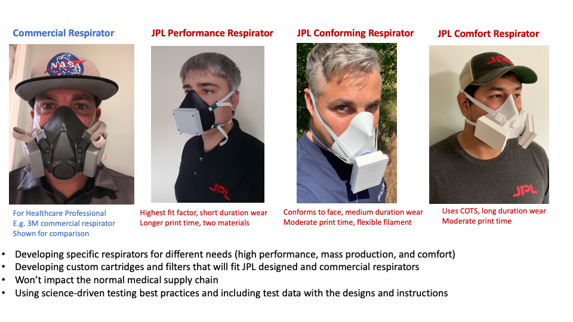

# JPL COVID-19-respirators

JPL designed and tested 3D printed respirators to help with the COVID-19 pandemic response. The designs and instructions for three different types of respirators and the resulting detailed test data is published here. In addition, designs and instructions for custom filters are also included. These designs were tested according to many criteria, including fit checks,  breathability, comfort, etc, and the [test results are available](https://drive.google.com/file/d/1wHfQ2mfvhPVK0e2QqBtErNonMUchVUmq/view?usp=sharing). *Note that these respirators are not certified by NIOSH or any medical institution, so use at your own risk*.

These designs, instructions, STL files, and JPL's initial test data are released to Open Source with the hope that companies and individuals who have access to 3D printers, and who want to help, can print or create these for those who need them. ​We are purposefully not using materials in the normal medical supply chain as it should be kept free to create commercial and certified respirators. We expect and hope that these designs will be commented on and improved by everyone during and after this pandemic.

To decide which respirator is right for your use, please consider these questions:
 1. How are you planning to use the mask?
 2. What tradeoffs between comfort and sealing are right for you? (See the test results)
 3. What materials do you have available?
 4. Which printers do you have access to?
 5. What’s your face shape?
 6. What’s your face size?

Below are sections for three different respirator designs that are intended for different uses, how to make your own cartridges and filters, how to test them, a disclaimer, and acknowledgements:
 1. [Design 1: The Performance Respirator](https://github.com/nasa-jpl/COVID-19-respirators/wiki/JPL-Performance-Respirator)
 2. [Design 2: The Comfort Respirator](https://github.com/nasa-jpl/COVID-19-respirators/wiki/JPL-Comfort-Respirator)
 3. [Design 3: The Conforming Respirator](https://github.com/nasa-jpl/COVID-19-respirators/wiki/JPL-Conforming-Respirators)
 4. [Design 4: Creating custom cartridges to fit the respirators](https://github.com/nasa-jpl/COVID-19-respirators/wiki/Custom-Filters-to-fit-the-respirators)
 5. [Respirator Fit Test Results](https://github.com/nasa-jpl/COVID-19-respirators/wiki/Select-Respirator-Fit-Test-Results)
 6. [Doing your own Fit Test Check](https://github.com/nasa-jpl/COVID-19-respirators/wiki/Doing-your-own-Fit-Check-(aka-seal-test))
 7. [Other Resources](https://github.com/nasa-jpl/COVID-19-respirators/wiki/Other-Resources)
 8. [Disclaimer](https://github.com/nasa-jpl/COVID-19-respirators/wiki/Disclaimer)
 9. [Acknowledgements](https://github.com/nasa-jpl/COVID-19-respirators/wiki/Acknowledgements)
 
