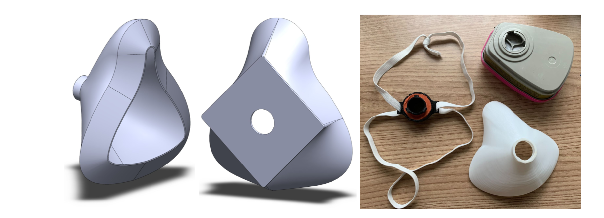
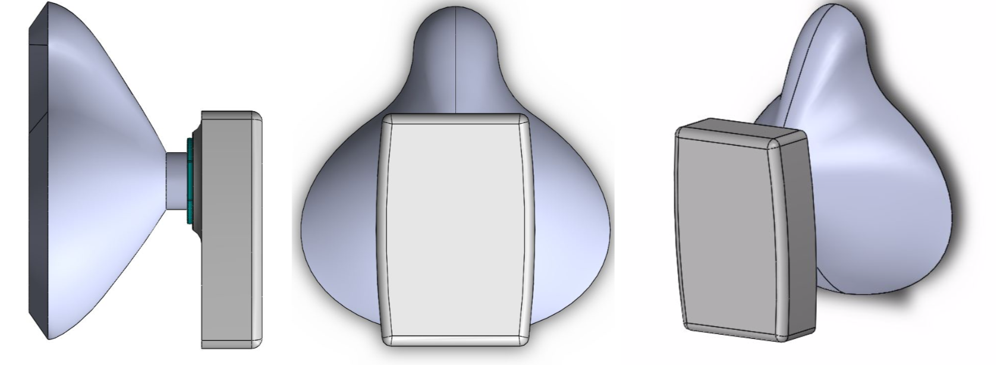
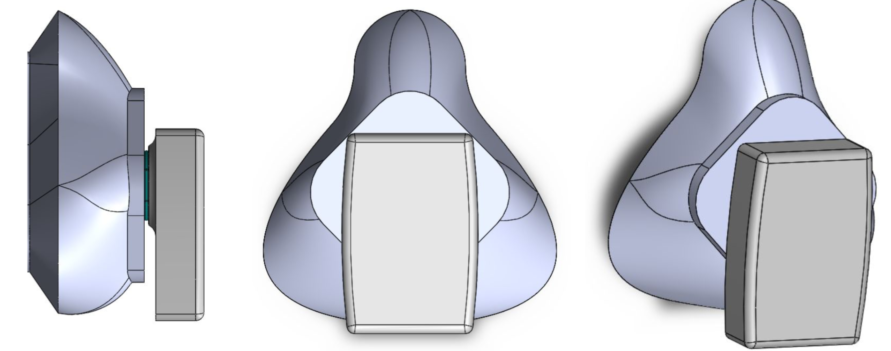
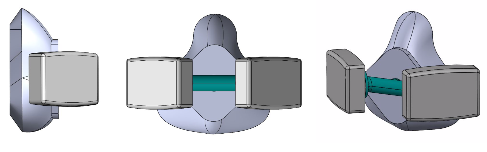
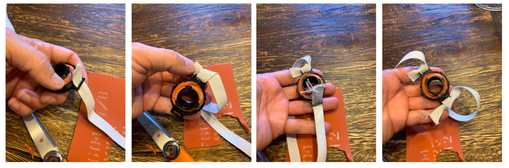
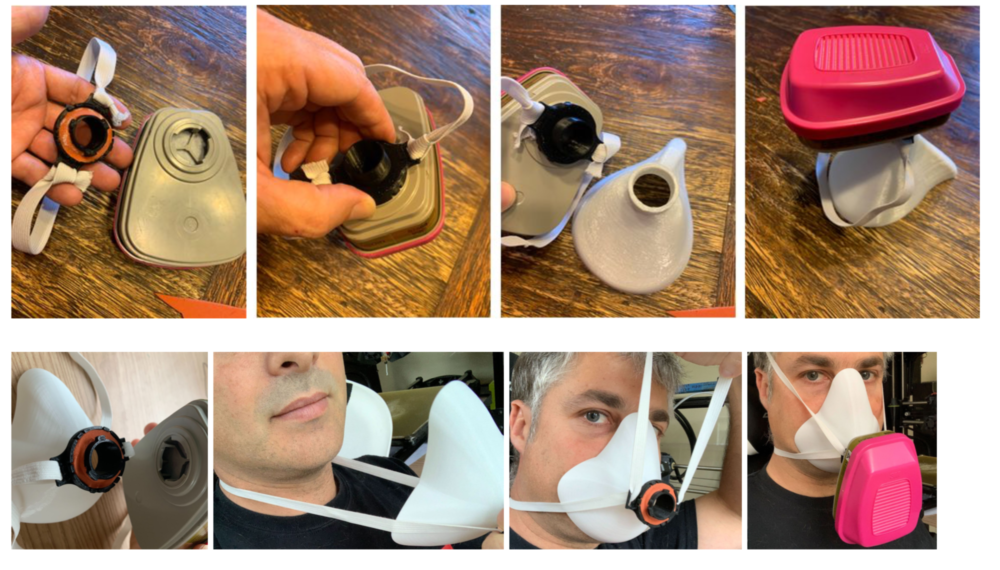
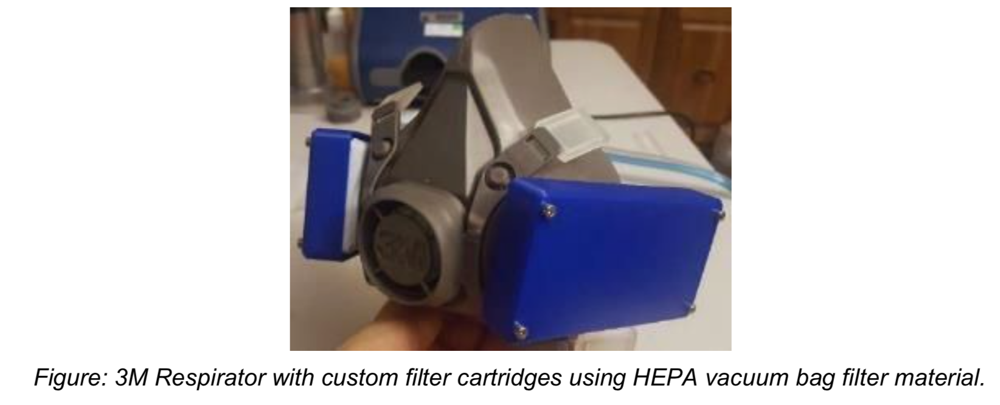
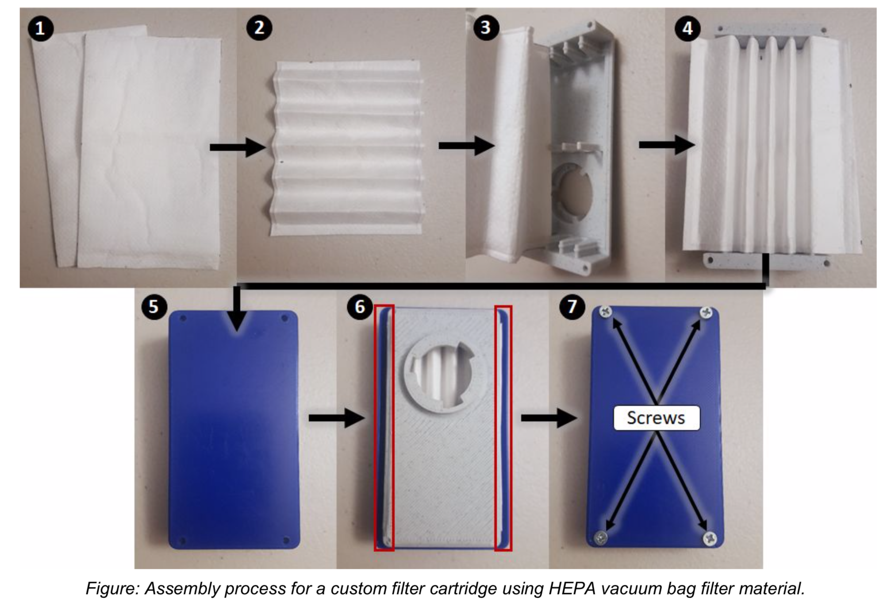
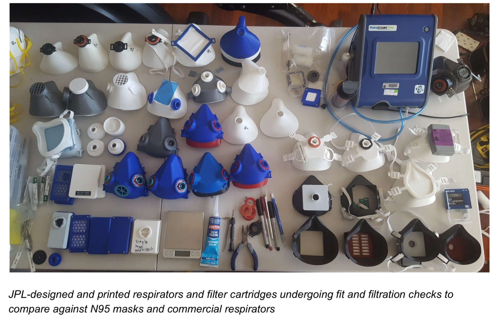

# JPL COVID-19-respirators
JPL designed and tested 3D printed respirators to help with the COVID-19 pandemic response.
The designs and instructions for three different types of respirators and the resulting detailed test data is published here.
In addition, designs and instructions for custom filters are also included.
You can review JPL's test results but these respirators are not certified by NIOSH or any medical institution, so use at your own risk.

These designs, instructions, and test data are released to Open Source with the hope that companies and individuals who have access to 3D printers, and who want to help, can print or create these for those who need them. ​We are purposefully not using materials in the normal medical supply chain as it should be kept free to create commercial and certified respirators. We expect and hope that these designs will be commented on and improved by everyone during and after this pandemic.

To decide which respirator is right for your use, please consider these questions:
 1. How are you planning to use the mask?
 2. What tradeoffs between comfort and sealing are right for you? (See the test results)
 3. What materials do you have available?
 4. Which printers do you have access to?
 5. What’s your face shape?
 6. What’s your face size?

Below are sections for three different respirator designs that are intended for different uses, how to make your own cartridges and filters, how to test them, a disclaimer, and acknowledgements:
 1. [Design 1: The Performance Respirator](https://github.com/nasa-jpl/COVID-19-respirators/blob/master/README.md#1-design-1-jpl-performance-respirator)
 2. [Design 2: The Comfort Respirator](https://github.com/nasa-jpl/COVID-19-respirators#2-design-2-jpl-comfort-respirator)
 3. [Design 3: The Conforming Respirator](https://github.com/nasa-jpl/COVID-19-respirators#3-design-3-jpl-conforming-respirators)
 4. [Design 4: Creating custom cartridges to fit the respirators](https://github.com/nasa-jpl/COVID-19-respirators#4-design-4-custom-filters-to-fit-the-respirators)
 5. [Respirator Fit Test Results](https://github.com/nasa-jpl/COVID-19-respirators#5-select-respirator-fit-test-results)
 6. [Doing your own Fit Test Check](https://github.com/nasa-jpl/COVID-19-respirators#6-doing-your-own-fit-check-aka-seal-test)
 7. [Other Resources](https://github.com/nasa-jpl/COVID-19-respirators#7-other-resources)
 8. [Disclaimer](https://github.com/nasa-jpl/COVID-19-respirators#8-disclaimer)
 9. [Acknowledgements](https://github.com/nasa-jpl/COVID-19-respirators#9-acknowledgements)
 
# 1. Design 1: JPL Performance Respirator
## Overview
<a href="https://github.com/nasa-jpl/COVID-19-respirators/tree/master/stl/design1-performance/">Download STL files</a> 

The performance respirator design attempts to mimic the face seal geometry of commercial half-face respirators, such as those from 3M, to provide the highest level of fit performance. This is achieved through the use of a two piece assembly that consists of both a flexible and rigid element. The rigid element provides effective attachment for external filter cartridges while the flexible element has an internal lip to provide a conformal seal against the user’s face. The design also allows the front rigid section to be exchanged for compatibility with a wide range of different filter configurations while preserving the face seal and mounting straps.

The performance respirator design can be easily configured for use with different filter types by swapping the front rigid element. By swapping the front rigid element, the respirator can currently be arranged in two different configurations; front adapter compatible with COTS/custom filter cartridges or with a compact integrated custom filter.

 * Filter Cartridge Mount - In this configuration the rigid section consists of a cover plate that slots into the flexible face seal and provides a filter cartridge attachment point. Currently, the design is configured to be compatible with 3M filter cartridges but the intent is to provide options based on community input.
 * Integrated Custom Filter - In this configuration the front rigid section consists of two pieces with an integrated pleated filter (total surface area of 98 cm2) and provides the most compact arrangement that can fit under a standard face shield. Intake and exhaust both pass through the filter medium and are routed to the sides of the respirator. Additional information on the custom integrated filter can be found in the “Custom Filters” section.

The following subsections will describe the tools/equipment required, materials used, fabrication process, assembly guide.

## Tools and Equipment:
 * FDM 3D printer
     * Standard 0.4 mm print nozzle
     * Print area must be greater than 15x15 cm.
     * Capable of printing TPU (direct drive extruder recommended)
 * Xacto blade or similar
 * Calipers (optional)

## Materials Required:
 * PLA or PETG Filament - Used for rigid components
     * PETG is recommended for higher temperature and chemical resistance.
 * Shore 95A TPU Filament  - Used for flexible face seal.
     * Ninjaflex Cheetah and Polymaker Flex have been tested.
 * 3/8 “ Elastic Banding (36” Length) - Standard elastic banding for sewing is sufficient.
 * 3/16” Thick Foam or Equivalent - Used for the cartridge attachment point seal.
     * Compliant foam such as a contact shelf liner would work.
 * Filter Medium - An appropriate filter medium for use with the integrated filter.
     * HEPA vacuum bag material (Kenmore brand) currently recommended.
 * Note, currently *not* NIOSH certified for medical use.
     * Additional information in the custom filter section.

## Components and Fabrication

The standard version compatible with stock filter cartridges consists of only 9 components. Below is a short description of each part with fabrication guidelines. Note, the integrated filter cartridge version follows the same process but swaps the filter cartridge adaptor for the integrated filter.

### Printed Parts
 * 1x Flexible Face Seal - The flexible face seal should be printed first from a 95A TPU material in a size appropriate for the user.
     * Material - Shore 95A TPU (NinijaFlex Cheetah and Polymaker Flex have both been verified to work)
     * Print Settings - 0.2 mm layer height, 2 perimeters, 0.45 mm line width
     * Notes - If calipers are available, measure the thickness of the front lip. This value can be used to select the appropriate rigid adaptor size.
 * 1x Rigid Adaptor Plate
     * Material - PLA or PETG
     * Print Settings - 0.2 mm layer height, 3 perimeters, 0.45 mm line width, 10% infill
     * Notes - Multiple files are provided to allow for variation in print tolerances. The end
designator indicates the size fihte slot used to mount
 * 4x Strap Adjustment Clips
     * Material - PLA or PETG
     * Print Settings - Normal print settings.
     * Notes - None.

### Other:
 * 1x Filter Cartridge Seal - Reference designs respirator designs 2 &3 for instructions on
cutting the foam ring seals.
 *  2x Straps - Cut two strips to a length of 46 cm (18”). This can be increased or decreased
based on user preference.
 * 1x Integrated Filter (Option) - Instructions for the filter assembly are provided in the “Custom
Filters” section.

General fabrication notes and tips will be provided here and periodically updated based on user comments and questions.

 * *PLA is very easy to print but has a low softening temperature and is susceptible to warping at elevated temperatures (such as in the hot interior of a parked vehicle during the summer). If you expect that respirator may be stored in a location where the temperature can exceed 100 oF, the use of PETG is recommended.*

## Respirator Assembly

Once the required parts are printed, this is the basic assembly process (refer to pictures below):

 1. Prepare the flexible face seal section. Pull away any stringers and left from the printing process.
 2. Slot the top lip of the flexible face seal into the matching groove on the rigid filter cartridge adaptor plate or integrated filter cartridge. This connection is meant to be tight, and should not be loose as it seals the rigid element against the flex face seal.
     a. If the connection is either too loose or tight reprint the rigid element with the corresponding smaller or larger slot size version respectively. Groove sizes of 0.8, 0.85, and 0.9 mm will be provided (0.85 mm is default). Different printers will vary in dimensional tolerance so this will have to be checked on a case by case basis.
 3. Place the filter cartridge seal ring over the cartridge attachment point on the rigid front plate.
 4. Attached straps through the mount points on the flexible face seal using the strap clips to allow for length adjustment. Alternately the straps can simply be tied off.
 5. Attach filter cartridge if required.
 6. Test fit and adjust strap tension as required.

## Reference Images:

<a href="https://github.com/nasa-jpl/COVID-19-respirators#jpl-covid-19-respirators">Return to Top</a>

# 2. Design 2: JPL Comfort Respirator
## Overview
<a href="https://github.com/nasa-jpl/COVID-19-respirators/tree/master/stl/design2-comfort/">Download STL files</a> 

Designed to be manufactured and assembled with little expertise and non-specialized equipment. Printable in two configurations rigid and flexible. All manufacturing materials are easily found at hardware or hobby shops. The chosen 3D printable materials include PLA, PETG and Ninjatek’s Cheetah (TPU) ; these are all common and easily printable filaments with most 3D printers. All assembly parts can be made of either but there are advantages for choosing the most recommended.

## Respirator Overview

The rigid configuration requires an added peel back weatherseal EDPM rubber (*not shown*) that ensures a positive seal and wearer comfort. The flexible configuration can be configured with or without added seal edge for greater comfort and seal assurance during jaw movement.

### Tools Required
 * FDM 3D Printer (direct drive preferred)
 * Scissors / Small cutters
 * Pliers
 * PliersRuler / Measuring tape (optional)
 
### Materials Required
 * 3D printer filament (PLA, PETG, Ninjatek Cheetah TPU) “Housing & Accessories”
 * 3⁄8”-1⁄2” Elastic Bands “Headbands”
 * Contact solid grip shelf liner. “Component seals”
 * EPDM D-profile weather-seal 5/16” wide 1⁄4” thick (required for rigid housing, optional for flexible housing) “Face
seal”

### Bill of Materials
| Component|Qty|Manufacturing method|
|---|---|---|
|Housing |1|3D printed|
|Cartridge Adapter|2|3D printed|
|Adapter Nut|3|3D printed|
|Port Seal|1|3D printed|
|Component Seal|4|Hand-cut|
|Headbands|2|Hand-cut|
|Face Seal (optional for flexible housing)|1|Hand-cut|

### Build Steps
 1. *Measure mendon-sellion length*
    Mendon-sellion length (face length): The vertical distance from the tip of the chin to the deepest point of the nasal root depression between the eyes.
    
 2. *Choose the right housing STL according to size and mask configuration*
    
 3. *3D Print the respirator housing*
    The recommended material for the housing is Cheetah TPU, as this will allow housing to flex and form to the face maintaining a positive seal during face movements. To avoid layer gaps and stringing, it is recommended that you print a single housing with no other parts on the printer bed. Recommended print settings; 5 perimeters, 5 top and 5 bottom layers @ 0.20mm layer height with a .040mm nozzle to ensure proper body seal. If available, use “Extra perimeters if needed”,”Cross perimeter avoidance”, and “Thin wall detection” on slicer application. Then follow filament manufacturer guidelines for material print settings. Faster print times may be achieved with a larger nozzle but this design and settings are intended for most common 3D printer configuration.
  4. *3D Print cartridge adapter and accessories*
The most recommended material for respirators accessories is PETG, this will give you the best mechanical advantages.
    
  6. *Cut seals and headbands*
Use the 3D printed seal template to trace and cut the seals, you can fold the seal in half to cut the inner circle.
    
  Wrap elastic around the wearer's head without stretching it at nose level and cut two elastics of same length, alternatively you can measure out and cut one piece to approx. length of 22” and a second one to 18”, you can trim excess after a fit test if necessary.
    
  7. *Respirator Assembly*
      * Gather all pieces
      * Install seals on both sides of the cartridge adapters
  
      * Insert cartridge adapters to side ports and port seal to front port.
   
      * Install adapter nuts, do not tighten.
  
      * Orient the smaller cartridge key to the center of the housing.
  
      * While holding both sides tighten adapter nuts with pliers or 3D printed tool, do not overtighten.
  
      * Install headbands by inserting the long end from the back of the strap mount thru the closest to to center slot.
  
      * Continue to zig-zag the strap thru all the slots of the strap mount
  
      * Repeat this for all four strap mounts.
  

<a href="https://github.com/nasa-jpl/COVID-19-respirators#jpl-covid-19-respirators">Return to Top</a>

# 3. Design 3: JPL Conforming Respirators
## Overview:
<a href="https://github.com/nasa-jpl/COVID-19-respirators/tree/master/stl/design3-conforming/">Download STL files</a> 
Using more advanced printing material and multiple extruder nozzle size options this design is focused on conforming to a wide range of faces and accelerated printing. This means fewer sizes are needed to comfortably seal to the range of human face dimensions.
  

This comes in two styles, Fast Vase and Low Profile Vase variations shown above. Each of these can use a single or double filter adapter shown below. Depending on size these prints range from 30 minutes with a 1.2 mm nozzle and up to 4.5 hours with a traditional 0.4 mm nozzle.
### Fast Vase Print Single Filter:
  

### Low Profile Vase Single Filter Variation:
  

### Low Profile Dual Filter:
  
  
## Tools Required
 * FDM 3D Printer (direct drive preferred, larger nozzle size preferred)
 * Scissors / Small cutters

## Materials Required
  * Facial Interface: 3D printer filament (Ninjatek Cheetah TPU, Polymaker Polyflex, Matterhackers Pro TPU)
  * Adapter: 3 D printer filament (PETG, PLA or ABS or other rigid filament.)
  * Straps: 3⁄8”-1⁄2” Elastic Bands (sewing elastic, rubber bands or string can also be used)
  * Component seals: Contact solid grip shelf liner, dense foam or rubber sheet.

## Bill of Materials
| Component|Qty|Manufacturing method|
|---|---|---|
|Facial Interface |1|3D printed|
|Cartridge Adapter|1|3D printed|
|Seals|1-2|Hand-cut|
|Straps|1|Hand-cut|

## Directions:
  1. If using existing files measure your menton-sellion (m) length. If you would like to design a custom fit take the measurements to fill in the table below.
  <table>
  <tr>
    <td colspan="4">Choose units (mm preferred)</td>
  </tr>
  <tr>
   <td>Measurements</td>
   <td>&nbsp;</td>
   <td>&nbsp;</td>
   <td>&nbsp;</td>
  </tr>
  <tr>
   <td>Nasal Contour</td>
   <td>&nbsp;</td>
   <td>&nbsp;</td>
   <td>&nbsp;</td>
  </tr>
  <tr>
   <td>Menton-sellion length(m)</td>
   <td>&nbsp;</td>
   <td>&nbsp;</td>
   <td>&nbsp;</td>
  </tr>
  <tr>
   <td>Bigonial breadth(n)</td>
   <td>&nbsp;</td>
   <td>&nbsp;</td>
   <td>&nbsp;</td>
  </tr>
</table>

2. Choose STL based off of menton-sellion length:
 <table>
  <tr>
    <td>Size</td>
    <td>STL</td>
  </tr>
  <tr>
   <td>10-12 cm</td>
   <td>Invert M.stl</td>
  </tr>
  <tr>
   <td>9-10cm</td>
   <td>Invert S.stl</td>
  </tr>
  <tr>
   <td>12-13 cm</td>
   <td>Invert L.stl</td>
  </tr>
 </table>
  
Or modify cad appropriately:

3. 3D Print respirator
To avoid layer gaps and stringing it is recommended that you print a single housing with no other parts on the printer bed. Recommended print settings; 5 perimeters,5 top and 5 bottom layers @ 0.20mm layer height with a .040mm nozzle. If available use “Extra perimeters if needed”,”Cross perimeter avoidance”,”Thin wall detection” on slicer application. Then follow filament manufacturer guidelines for material print setting. Faster print times may be achieved with a larger nozzle but this design and settings are intended for most common 3D printer configuration.
For ease of printing here are the print profiles for Cheetah TPU filament on the TAZ 6 with Moarstruder and the Prusa. More profiles and materials to come.

<table>
   <tr>
    <td>Printer</td>
    <td>Nozzle Size</td>
    <td>Material</td>
    <td>Profile File Name</td>
    <td>Comments</td>
 </tr>
 <tr>
  <td>Taz 6</td>
  <td>1.2</td>
  <td>Cheetah</td>
  <td>Cheetah Moar Vase Profile.curaprofile</td>
  <td>In special modes click spiralize outer contour</td>
 </tr>
 <tr>
  <td>Taz 6</td>
  <td>1.2</td>
  <td>Matterhackers Pro TPU</td>
  <td>Pro TPU Moar Vase Profile.curaprofile</td>
  <td>In special modes click spiralize outer contour. Use Tune on the printer and increase Flow to 120 at beginning of print</td>
 </tr>
 <tr>
  <td>Prusa</td>
  <td>0.4</td>
  <td>Cheetah</td>
  <td>Cheetah - TPU.ini</td>
 </tr>
 <tr>
  <td>Prusa</td>
  <td>0.8</td>
  <td>Cheetah</td>
  <td>Cheetah 0.8 - TPU.ini</td>
 </tr>
</table>

4. 3D Print cartridge adapter and accessories

<table>
 <tr>
  <td>STL</td>
  <td>QTY</td>
  <td>File Name</td>
 </tr>
 <tr>
  <td>Single Cartridge Adapter</td>
  <td>1x</td>
  <td>Low Profile Filter Adapter</td>
 </tr>
 <tr>
  <td>Double Cartridge Adaptor</td>
  <td>1x</td>
  <td>Wide Double Filter Adaptor 3.stl</td>
</table>

These can be printed out of your favorite rigid filament.

5. Cut seals and headbands
Cut circular seals for your adaptor as shown: Foam or shelf liner material works well as a seal.

Cut sewing elastic and tie as shown:

6. Assemble pieces and test

<a href="https://github.com/nasa-jpl/COVID-19-respirators#jpl-covid-19-respirators">Return to Top</a>

# 4. Design 4: Custom Filters to fit the respirators
## Overview:
<a href="https://github.com/nasa-jpl/COVID-19-respirators/tree/master/stl/design4-filters/">Download STL files</a> 
Because there is a critical shortage of commercial respirator filters, the JPL team designed, built, and tested custom filters with the respirators. This section describes how to build those.

The filter media can either be Commercial Off The Shelf (COTS) filter cartridges, like the P100 filter, or they can be home-built filters that either use cut up N95 masks or HEPA filter material. We have been testing the performance of different HEPA filters from hardware stores to demonstrate how well they filter out particles. Additionally, it was found during testing that flat filter material implementation did not provide sufficient filter surface area causing high breathing resistance and reducing filter effectiveness. Consequently the custom filter cartridges described here utilize a pleated filter material design to significantly increase the filter surface area to make it easier to breathe.

## Custom Filter Cartridge - 3M Compatible:

A custom filter cartridge was designed to both be compatible with 3M style adaptors and allow the use of alternate filter materials, such as HEPA vacuum bags. It is intended that future cartridge designs will provide compatibility with other brands. For this design, the pleated filter material provides 3.25x greater surface area compared to flat sheet.

## Printed Parts:
* 1x Filter Base
    * Material - PLA or PETG
    * Print Settings - 0.2 mm layer height, 3 perimeters, 0.45 mm line width, 10% infill
    * Notes - Is printed with additional perimeter to reduce the likelihood of porous side walls.
* 1x Filter Cover - 
    * Material - PLA or PETG
    * Print Settings - Normal print settings.
    * Notes - None.

## Other:
 * 2x HEPA Filter Cloth​ - Reference designs respirator designs 2 &3 for instructions on cutting the foam ring seals.
 * 4x #4 x 3⁄8” Flat Head Wood or Sheet Metal Screws - These can commonly be found at larger hardware stores in the fastener section.

## Assembly (see pictures below to go with the text):
 1. Cut two sheets of the filter cloth to a size of approximately 84x138 mm (3.31”x5.43”).
 2. Create 13mm (1⁄2”) pleats in the filter cloth. The small 3mm ends should also be folded. Taking care with this step makes the rest go more smoothly.
 3. Insert the two pleated filter cloths into the filter base.
 4. Ensure that the filter cloth is fully seated. Using a small screwdriver to push the valleys of the filter into the frame helps with this.
 5. Insert filter cover to clamp the filter cloth.
 6. Check that the exhaust channels are not blocked by excess filter material. If the channels are blocked remove the cover; trim a small amount from the filter cloth; and then replace the cover.
 7. Secure the filter cover with four #6 flat head wood screws.
 
 
 
## Integrated Filter Cartridge - Design 1 Filter:
The integrated filter cartridge utilizes the same pleated design and is assembled in the same manner as the 3M compatible version but in the size package directly compatible with Design1’s flexible face seal. Please reference the section above for materials, components, and additional assembly details.

### Assembly (see pictures below to go with the text):
Cartridge assembly follows the same process as the 3M compatible cartridge. A condensed version is described below:
 1. Fold two 61x190 mm (2.4”x7.5”) layers of filter material with 13 mm (1⁄2”) pleats.
 2. Insert pleated filter material into the filter cartridge base.
 3. Attach cover and fixture in place with four #6 flat head screws.
  

<a href="https://github.com/nasa-jpl/COVID-19-respirators#jpl-covid-19-respirators">Return to Top</a>

## 5. Select Respirator Fit Test Results
The test results document describes the performance of the respirators in the JPL tests. They were tested by the same individual and the same equipment for comparisons. Your results may vary depending on the size and shape or your face. Please perform a fit test before using them. The test results can be viewed at:

 * https://drive.google.com/file/d/1wHfQ2mfvhPVK0e2QqBtErNonMUchVUmq/view?usp=sharing
 

<a href="https://github.com/nasa-jpl/COVID-19-respirators#jpl-covid-19-respirators">Return to Top</a>

# 6. Doing your own Fit Check (aka seal test):
Please ensure the respirator user performs a fit check before using these in a potentially hazardous setting.
We recommend the published CDC NIOSH positive and negative seal check procedure​ before using the respirator to make sure that it is of proper size and to ensure there weren't any faults during manufacturing/assembling. Do this without filter cartridges installed, ports should be easily blocked with the palms of your hands.
How to do a positive pressure user seal check

Once the particulate respirator is properly donned, place your hands over the facepiece, covering as much surface area as possible. Exhale gently into the facepiece. The face fit is considered satisfactory if a slight positive pressure is being built up inside the facepiece without any evidence of outward leakage of air at the seal. Examples of such evidence would be the feeling of air movement on your face along the seal of the facepiece, fogging of your glasses, or a lack of pressure being built up inside the facepiece. If the particulate respirator has an exhalation valve, then performing a positive pressure check may be impossible. In such cases, a negative pressure check should be performed.

## How to do a negative pressure user seal check
Negative pressure seal checks are typically conducted on particulate respirators that have exhalation valves. To conduct a negative pressure user seal check, cover the filter surface with your hands as much as possible and then inhale. The facepiece should collapse on your face and you should not feel air passing between your face and the facepiece. In the case of either type of seal check, if air leaks around the nose, use both hands to readjust the nosepiece by placing your fingertips at the top of the metal nose clip. Slide your fingertips down both sides of the metal strip to more efficiently mold the nose area to the shape of your nose. Readjust the straps along the sides of your head until a proper seal is achieved.2 If you cannot achieve a proper seal due to air leakage, you may need to be fit tested for a different respirator model or size.”

 1. [CDC NIOSH](https://www.cdc.gov/niosh/docs/2018-130/pdfs/2018-130.pdf)
 
 <a href="https://github.com/nasa-jpl/COVID-19-respirators#jpl-covid-19-respirators">Return to Top</a>
 
# 7. Other Resources
There are many resources for learning how to properly fit and test your respirator. See the following links for instructions:

 * https://www.youtube.com/watch?v=yBg2B2BP9nA
 * https://www.youtube.com/watch?v=DzIDhYGnDIM
 * https://www.worksitemed.com/niosh-explains-respirator-seal-checks/
 
 <a href="https://github.com/nasa-jpl/COVID-19-respirators#jpl-covid-19-respirators">Return to Top</a>
 
# 8. Disclaimer
The designs herein have not been reviewed, cleared, or approved by FDA or other regulatory authority, nor have they received Coronavirus Disease 2019 (COVID-19) Emergency Use Authorizations for Medical Devices. Neither California Institute of Technology (including the Jet Propulsion Laboratory)(“Caltech”) nor its employees or agents provide any representation or warranty, express or implied, for fitness for a particular purpose, safety, efficacy, or non-infringement of any third party intellectual property rights. Caltech offers these device designs in good faith to help healthcare providers and others prevent the spread of and treat patients with COVID-19. Physicians and other healthcare providers bear full responsibility to convey warnings and obtain patients’ informed consent.

<a href="https://github.com/nasa-jpl/COVID-19-respirators#jpl-covid-19-respirators">Return to Top</a>

# 9. Acknowledgements
The research was carried out at the Jet Propulsion Laboratory, California Institute of Technology, under a contract with the National Aeronautics and Space Administration.

<a href="https://github.com/nasa-jpl/COVID-19-respirators#jpl-covid-19-respirators">Return to Top</a>

